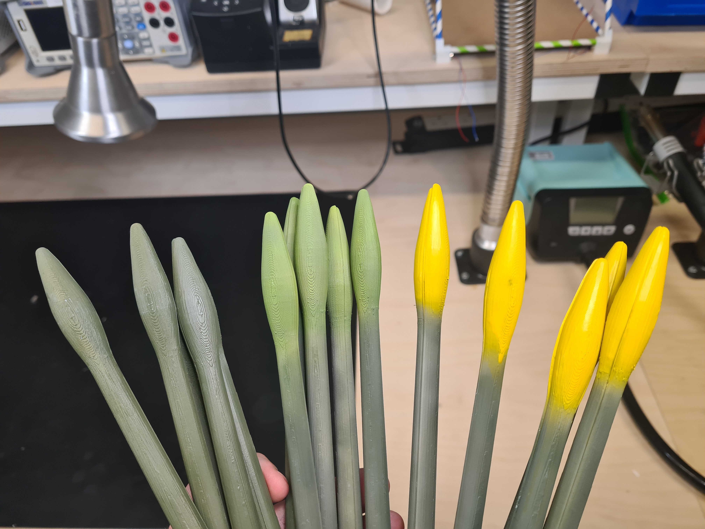

# README
## TASK

This is the gantry task for the 11/11/2022 to 12/11/2022 Falmouth Hackathon, the gantry system must complete a series of actions listed below:

Find and pickup faux yellow daffodils using the Gantry System and return them to a basket.

The Faux Daffodils; you only want to pick up the bright green ones in the middle:

## SETUP

1. Install Python 3.11.0 from https://www.python.org/downloads/release/python-3110/ the download links will be at the bottom of the page, download 32-bit or 64-bit dependent on your machine.
2. We recommend using visual studio code to manage the code in the project, this can be downloaded from https://code.visualstudio.com/ 
3. Install the python extension for Visual Studio Code, this can be done by clicking on the three blocks on the left side bar inside visual studio and searching for python, it will be the first one on the list which has the microsoft blue tick under it.
4. Restart your computer to ensure that python is fully installed and correctly PATHed
5. Download the pyserial package for python  using "py -m pip install pyserial" py might also be just python dependent on how it was installed.

## Helpful Things

We have written a library to help you complete these tasks called "gantry.py" which contains several functions to move the gantry.
The library contains an object called "Gantry" and for this example "Gantry" is being assigned to dafBot.
For a good example of how all these functions work look at "example-move.py" as it is a pre written example of the code.

> dafBot = Gantry(FCOM()) - This searches avaliable COM ports on your pc and looks for the one with an arduino attached and then sets up an object called dafBot which is assigned to that COM port.
***IMPORTANT: this works (as far as I am aware) for all windows and linux PCs but has been untested on macs***

> dafBot.home_all() - This should be called before running any other code as it allows the Gantry to find a home position to work from, essentially it finds 0,0. There is individual home x,y,z however its easier to just home all to find 0,0
***IMPORTANT: this should not be used to return to [0,0,0], only to set [0,0,0] as it is not efficient and uses unessasary components***

> dafBot.move([X,Y,Z],SPEED) - Moves the Gantry Head to a specific x,y,z coordinate 
***IMPORTANT: the ranges of the head are: X = 0 to 730, Y = 0 to 440, Z = 0 to -240, we also recommend not turning the speed above 11000***

> dafBot.gripper_open() - Opens the gripper using the servos, has a 1 second delay after it opens to ensure it is fully open and working.

> dafBot.gripper_close() - Closes the gripper, exact oppisite of "gripper_open"

- Kernow Robotics.